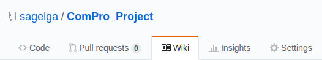

#  Introduction
สวัสดีครับ วันนี้กลุ่ม POS System เราได้สร้างโปรแกรมที่นำไปใช้กับเครื่องคิดเงิน (หรือที่เรียกว่า ระบบ Point of Sale) อย่างเต็มรูปแบบ และสามารถทำงานได้จริง และรองรับการทำงานได้ในหลายระบบปฎิบัติการที่สร้างขื้นจากระบบ UNIX โดยการใช้เพียงภาษา C ในการเขียน 100%

โดยนอกเหนือจาก ระบบ POS แล้ว ทางระบบได้มีระบบการคาดเดาข้อมูลเกี่ยวกับการขาย และการสมัครสมาชิกของผู้ใช้งานร่วมกับการขายของทั่วไป

ทำให้ระบบ POS นี้ทำงานได้อย่างครบวงจร เหมาะสำหรับการใช้งานกับร้านค้าต่างๆ เช่นร้านสะดวกซื้อ ร้านของชำ ร้านอาหาร เป็นต้น

---
#  Table of Contents
|[Install](https://github.com/sagelga/ComPro_Project/tree/develop/readme#--installation)|[How to use](https://github.com/sagelga/ComPro_Project/tree/develop/readme#-contributing)|[Features](https://github.com/sagelga/ComPro_Project/tree/develop/readme#features)|[Wiki](https://github.com/sagelga/ComPro_Project/wiki)|[Team Member](https://github.com/sagelga/ComPro_Project#-team-members)|[Contribute](https://github.com/sagelga/ComPro_Project/tree/develop/readme#-contributing)|[System Report](https://github.com/sagelga/ComPro_Project/wiki/System-Report)
|-|----|-------|----|-----------|---------|-|

#   Installation
สำหรับการใช้งานนั้น ผู้ใช้จะต้องทำการ `git clone` เพื่อทำการนำโปรเจ็คเข้าสู่คอมพิวเตอร์ก่อน หากไม่ทราบวิธีการ clone ก็สามารถเรียนวิธีการ clone repository [ที่นี่](https://help.github.com/articles/cloning-a-repository/)

และทำการไปที่โฟล์เดอร์หลักของโปรเจ็ค แล้วพิมพ์ `make && make run` ผ่าน Command Line เพื่อเป็นการ สร้างไฟล์ Executable (.exe) และโปรแกรมจะเปิดโปรแกรมขื้นมาให้ทันทีอัตโนมัติ สามารถใช้ระบบได้เลยทันที


โปรแกรมของเรา จะรันได้อย่างราบรื่นมากที่สุดโดยผ่านการใช้ระบบปฏิบัติการ MacOS เวอร์ชั่นล่าสุด และระบบปฏิบัติการที่มาจาก UNIX (UNIX-based OS) เช่น Linux Ubuntu และผู้ใช้จะต้องมี GCP เพื่อทำการรันภาษา C (โดยปกติแล้ว ทุกเครื่องจะมี GCP อยู่แล้ว)

และผู้ใช้ควรปรับความกว้างหน้า Terminal (Command Prompt) เป็นขนาดอย่างน้อย 140 x 40 pixel หรือมากกว่านี้


---

# How to use
สำหรับการใช้งานระบบนั้น ทางผู้จัดทำได้จัดเก็บไว้ที่ https://github.com/sagelga/ComPro_Project/wiki

หรือเข้าไปโดยการกด 'Wiki' ที่ tab ด้านบน<br> 


เราแนะนำให้ท่านเข้าไปดูใน wiki เพื่อเรียนรู้วิธีการใช้งานระบบ

---

## Features
สำหรับการใช้งานระบบ POS ก็จะมีระบบย่อยๆ ต่างๆ เพื่อช่วยในการขาย เช่น
* เช็คสินค้าคงคลัง (Inventory)
* เช็คถึงยอดขาย (Sales)
* เช็คถึงยอดขายในอนาคต (Forecast)
* เช็คผู้ใช้งานอื่น (Personnel)
* เช็คประเภทของสินค้า (Category)
* เปลี่ยนระบบโปรโมชั่นสำหรับลูกค้า (Promotion)
* แก้ไขข้อมูลพื้นฐานของร้านค้า (Settings)

โดยทุกระบบที่ได้เกล่ามานั้น ผู้ใช้งานที่เป็น admin สามารถเข้าไปปรับแก้ได้ทั้งหมด และ**สามารถเปลี่ยน/เพื่ม/ลด ได้ตลอดเวลา**

###  Log In
ก่อนที่จะใช้งานระบบ POS ลูกค้าจำเป็นที่จะต้อง login เพื่อจะเข้าระบบเสียก่อน โดยการเข้าระบบจากหน้าแรก (หน้าปรับขนาดหน้าจอ)​
1. ให้กด 'Y' แล้วกด ENTER
2. พิมพ์ username (หรือใช้ scanner เช่นตัวยิงบาร์โค้ด) เข้าไปที่ระบบ
3. พิมพ์ password ของผู้ใช้งาน (user) นั้น
4. ระบบจะเช็คหาถึงความถูกต้องของ username / password และนำผู้ใช้ไปที่หน้่าหลัก


ในการใช้ demo นี้ คุณสามารถใช้

```
username : admin
password : admin
```

เพื่อทำการ login เข้าสู่ระบบ

> ท่านสามารถเข้าไปดูผู้ใช้งานได้ที่ไฟล์ `/Database/personnel.db`

---

###  Main menu
สำหรับการใช้งานระบบ POS ก็จะมีระบบย่อยๆ ต่างๆ เพื่อช่วยในการขาย เช่น


|Inventory|Sales|Forecast|Personnel|Category|Promotion|Settings|
|:-:|:-:|:-:|:-:|:-:|:-:|:-:|
|เช็คสินค้าคงคลัง|เช็คถึงยอดขาย|เช็คถึงยอดขายในอนาคต|เช็คผู้ใช้งานอื่น|เช็คประเภทของสินค้า| เปลี่ยนโปรโมชั่นสำหรับลูกค้า|แก้ไขข้อมูลพื้นฐานของร้านค้า|

โดยทุกระบบที่ได้เกล่ามานั้น ผู้ใช้งานที่เป็น เจ้าของร้าน (ผู้ใช้งานระดับ admin) **สามารถเข้าไปปรับแก้ได้ และ สามารถเปลี่ยน/เพื่ม/ลด ได้ทั้งหมด**

---

###  Shortcut Keys
|Q|V|B|ENTER|1 - 9|
|-|-|-|-|-|
|**Quit**<br/>Sign Out และปิดโปรแกรม|**Void**<br/>ยกเลิกการทำการ <br> (เฉพาะในหน้า POS)|**Back** <br/> กลับไปหน้าที่แล้ว|**Continue** / **Skip** <br> ทำงานต่อไป หรือ ให้ใช้ค่าเรื่มต้น <br/>  (แตกต่างกันในแต่ละหน้าจอ)|**Selection** <br/> ตัวเลือกในหน้าจอ

หรือผู้ใช้งานสามารถสังเกตุการใช้งาน shortcut ได้บนหน้า interface ทุกหน้า

---

###  POS Sales System


|Step 1|Step 2|Step 3|Step 4|
|:-|:-|:-|:-|
|กรอก รหัสบัตรสมาชิก (หากไม่มี สามารถกด Skip ขั้นตอนนี้ได้)|สแกนสินค้าที่ต้องการจ่าย <br>(หากสินค้าที่สแกน ไม่ได้อยู่ในระบบ หรือของคงคลังหมด ระบบจะแจ้งว่าสินค้านั้นไม่สามารถจ่ายได้)|หากลูกค้าอยากใช้คะแนนเป็นส่วนลด หรือใช้ Voucher เงินสด ก็สามารถสแกนเข้าไปได้|ยอดการใช้จ่ายครั้งนี้ และ ยอดคะแนนสะสมของลูกค้า จะถูกแสดงในขั้นตอนนี้|

---

###  Inventory Dashboard


|พิมพ์|เพื่อ|วิธีการใช้งาน|
|:-:|:---|----------|
|1|เช็คสินค้าคงคลัง|สามารถดูฐานข้อมูลได้ทันที <br> หากต้องการเปลี่ยนหน้าสามารถพิมพ์เลขหน้าที่อยากจะไปได้ในทันที|
|2|เพื่มรายการ|กรอกรายละเอียดของสินค้า <br> เช่นชื่อสินค้า รหัสบาร์โค้ด รายได้ที่จะได้รับ ราคา และปริมาณสินค้าคงคลัง โดยหลังจากเพื่มลงในระบบแล้ว ข้อมูลนี้จะเข้าไปอยู่ในฐานข้อมูลและสามารถใช้งานได้ทันที|
|3|เปลี่ยนข้อมูลในฐานข้อมูล|เปลี่ยนข้อมูลโดยการกรอกใหม่ทั้งหมด <br> หากไม่ต้องการเปลี่ยน สามารถใช้ข้อมูลเก่าได้|
|4|ลบสินค้าในฐานข้อมูล|ลบข้อมูลในฐานข้อมูล <br> โดยการพิมพ์รหัสสินค้า และกดยืนยัน หากยืนยันแล้ว ระบบจะลบข้อมูลของสินค้านั้นออก และไม่สามารถกู้กลับคืนได้|
|5|เช็คประเภทสินค้่า|สามารถดูฐานข้อมูลได้ทันที <br>  หากต้องการเปลี่ยนหน้าสามารถพิมพ์เลขหน้าที่อยากจะไปได้ในทันที|
|6|เพื่มประเภทสืนค้า|เพื่มชื่อประเภทสินค้่าโดยการพิมพ์ชื่อประเภทที่เราต้องการ <br> (หากมีชื่อนั้นอยู่แล้ว จะไม่สามารถตั้งซ้ำได้) <br> และระบบจะสร้าง ไอดี เพื่อนำไปติดกับสินค้าได้|
|7|เปลี่ยนชื่อของประเภทสืนค้า|เปลี่ยนชื่อประเภทสินค้าโดยการพิมพ์ชื่อประเภทเก่าที่ต้องการเปลี่ยน และพิมพ์ชื่อใหม่เข้าไป ระบบจะเปลี่ยนชื่อในทันที (ไอดีจะคงเหมือนเดิม ดังนั้นระบบจะยังสามารถทำงานต่อได้อย่างปกติ)|

###  Inventory Database Interface


###  Category Database Interface


###  Reporting Interface


---

###  Settings Dashboard


|พิมพ์|เพื่อ|วิธีการใช้งาน|
|:-:|---|----------|
|1|เปลี่ยนพาสเวิร์ด|สามารถเปลี่ยนรหัสเพื่อเข้าระบบของตนเองได้ <br> โดยการกรอกรหัสเก่า แล้วจึงสามารถเปลี่ยนรหัสใหม่ได้ โดยต้องพิมพ์ยืนยันอีกครั้งหนึ่ง <br> (หากพิมพ์ยืนยันผิด จะต้องเข้าไปทำการแก้ใหม่อีกครั้งตั้งแต่แรก)|
|2|เปลี่ยนชื่อหน้าร้าน|ชื่อร้านจะปรากฎในหน้าแรก และ หน้าการชำระเงิน โดยสามารถแก้ได้โดยการพิมพ์ชื่อใหม่เข้าไปในระบบ|
|3|เปลี่ยนที่อยู่ร้าน|ที่อยู่ร้านจะปรากฎในหน้าแรก และ หน้าการชำระเงิน โดยสามารถแก้ได้โดยการพิมพ์ชื่อใหม่เข้าไปในระบบ|
|4|เปลี่ยนค่าคะแนนที่จะได้รับจากการใช้จ่าย|โดยที่ การใช้จ่ายทุกๆ x บาท จะได้ 1 คะแนน <br> โดยเจ้าของร้านสามารถแก้ไขค่า x ได้ และจะเรื่มใช้งานด้วยเรทใหม่กับการทำรายการหลังจากการเปลี่ยนเท่านั้น (ไม่แก้ไขย้อนหลัง)|
|5|เปลี่ยนค่าคะแนนเป็นส่วนสดเงินสด|โดยที่ การใช้ x คะแนน สามารถแลกเป็นส่วนลดได้ 1 บาท <br> โดยเจ้าของร้านสามารถแก้ไขค่า x ได้ และจะเรื่มใช้งานด้วยเรทใหม่กับการทำรายการหลังจากการเปลี่ยนเท่านั้น (ไม่แก้ไขย้อนหลัง)|

###  Price to Point Interface


###  Terminate Interface

---

###  Forecast Dashboard


|พิมพ์|เพื่อ|
|:-:|:--:|
|1|ดูการคาดเดารายวัน (ตามประเภทสินค้า)|
|2|ดูการคาดเดารายเดือน (ตามประเภทสินค้า)|

สำหรับวิธีการคาดคะเนนั้น ทางเราใช้ Exponential Smoothing ในการคาดเดา

Exponential Smoothing เป็นรูปแบบหนึ่งของการพยากรณ์ท่ีให้ความสําคัญกับข้อมูลเก่าทุกค่า โดยให้ความสําคัญแก่ค่าท่ีใกล้ปัจจุบันมากท่ีสุด ลดหลั่นลงไปจนถึงค่าที่ 1 และถ่วงน้ําหนักข้อมูล โดยใช้สัมประสิทธิ์การปรับเรียบ (alpha)


Sum of squared errors (SSE) คือ การหาค่าความคลาดเคลื่อนของข้อมูลที่ได้จากการทำนาย กับข้อมูลที่เกิดขึ้นจริง


โปรแกรม Point of Sales (POS) Systems สามารถพยากรณ์ยอดขายให้ผู้ใช้ระบบ สามารถดูการพยากรณ์ยอดขายของวันถัดไป และเดือนถัดไปได้ โดยใช้หลักการของ Exponential Smoothing ร่วมกับค่า Sum of squared errors (SSE)

จากหลักการพยากรณ์ของ Exponential Smoothing จะต้องมีการเลือกค่าสัมประสิทธิ์การปรับเรียบ
(alpha) ที่เหมาะสม ซึ่งโปรแกรม POS จะทำการเลือกค่า  ที่เหมาะสมจากการคำนวนค่า Sum of squared errors โดยจะเลือกค่า alpha ที่มีค่า Sum of squared errors ที่น้อยที่สุด


###  Daily Forecast Interface


---

#  Team Members
|  |ชื่อ|นามสกุล|GitHub Username|รหัสนักศึกษา|
|:-:|--|------|---------------|---------|
||Kunanon|Srisuntiroj|[@sagelga](https://github.com/sagelga)|59070022|
||Thanawat|Laodkaew|[@skydddoogg](https://github.com/skydddoogg)|59070071|
||Noppanut|Ploywong|[@noppanut15](https://github.com/noppanut15)|59070082|
||Vasanchai|Prakobkij|[@59070156](https://github.com/@59070156)|59070156|
||Weerakorn|Pongpum|[@fablemay](https://github.com/@fablemay)|59070163|

#  Assistant Teacher
|ผศ. ดร. กิติ์สุชาติ พสุภา|ผศ. ดร. ปานวิทย์ ธุวะนุติ|
|:-:|:-:|
|||

รายงานนี้เป็นส่วนหนึ่งของวิชา Computer Programming (รหัส 06016206)

คณะเทคโนโลยีสารสนเทศ สถาบันเทคโนโลยีพระจอมเกล้าเจ้าคุณทหารลาดกระบัง

---

#  Contributing
หากท่านชอบใจระบบของเรา ท่านก็สามาถช่วยเราในการพัฒนาระบบเพื่มเติมได้โดยการ
1. ทำการ fork repository โดยการกดปุ่ม 'Fork'

2. แก้ไขโค้ด **บน forked repository** ของคุณ
3. เข้า repository หลัก และทำการสร้าง Pull Request
4. ให้ base branch เป็น develop และ compare branch เป็น branch fork ของคุณ
5. สร้าง Pull Request
6. ทางผู้จัดทำจะทำการอ่านและทำการดึงโค้ดใหม่ของคุณ

หรือเรียนวิธีการ fork ได้ที่ https://guides.github.com/activities/forking/

---

[](https://forthebadge.com)[](https://forthebadge.com)[](https://forthebadge.com)
