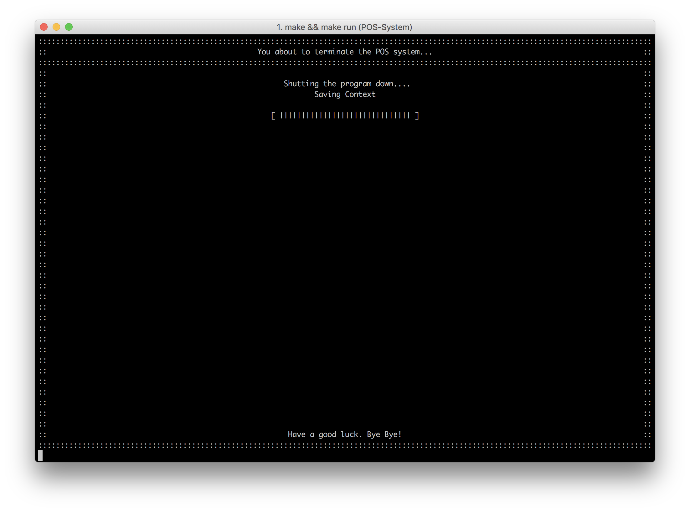

ระบบจุดขายหน้าร้าน (ระบบ Point of Sale หรือ POS) อย่างเต็มรูปแบบ และเขียนด้วยภาษา C ทั้งระบบ ซึ่งการเขียนในภาษา C นั้นทำให้ผู้ใช้งาน macOS หรือ Linux-based OS เป็นประโยชน์เพื่อให้ผู้ใช้ไม่จำเป็นที่จะต้องซื้อเครื่องคำนวณที่พลังแรงเพื่อมาใช้ระบบจุดขายหน้าร้านอีกต่อไป

สามารถตอบโจทย์การใช้งานหน้าร้านอย่างเต็มรูปแบบ ตัวอย่างเช่นระบบลูกค้าสัมพันธ์เพื่อให้ลูกค้าสามารถใช้คะแนนมาแลกเป็นส่วนลดสินค้า การจัดการสินค้าคงคลัง การกำหนดการเข้าถึงของพนักงานแต่ละคน พร้อมทั้งการจัดทำรายงานสำหรับยอดขายและการคาดเดายอดขายอีกด้วย ทำให้ระบบ POS นี้เหมาะสำหรับการใช้งานกับร้านค้าต่างๆ เช่นร้านสะดวกซื้อ ร้านของชำ ร้านอาหาร ฯลฯ

##  Documentation
เราได้สร้างเอกสารเกี่ยวกับความต้องการของระบบ (System Requirement), เอกสารประกอบการใช้งาน (User Manual) และทฤษฏีการคำนวณยอดขายล่วงหน้าไว้แล้วที่ [https://docs.sagelga.com/compro-project/](https://docs.sagelga.com/compro-project/) โดยเราแนะนำให้ผู้ใช้งานทุกท่านข้อมูลเกี่ยวกับระบบเพื่อประสบการณ์การใช้งานสูงสุด

##  System Requirement
โดยระบบ POS มีความต้องการของระบบดังนี้

1. คอมไพเลอร์ C (GCC)
2. อุปกรณ์คอมพิวเตอร์หรือเครื่องให้บริการ คีย์บอร์ด และหน้าจอแสดงผล
3. หน้าจออุปกรณ์คอมพิวเตอร์ที่สามารถแสดงหน้าจอเทอร์มินอลขนาด 140x40 หน่วยตัวอักษร หรือมากกว่า
4. (แนะนำ) อุปกรณ์สแกนบาร์โค้ด

##   Installation
สำหรับการใช้งานนั้น ผู้ใช้จะต้องทำการ `git clone` เพื่อทำการนำโปรเจ็คเข้าสู่คอมพิวเตอร์ก่อน [[อ่านวิธีการ Clone ได้ที่นี่](https://help.github.com/articles/cloning-a-repository/)]

เมื่อท่านได้ทำการ clone มาแล้วให้ท่านเข้าไปยังโฟลเดอร์ด้วยการใช้ Terminal หรือ Command Prompt และทำการพิมพ์สคริปต์:

``` shell
make && make run
```

สคริปต์จะทำการสร้าง Executable File (หรือไฟล์ .exe) และผู้ใช้งานสามารถใช้งานระบบได้ในทันที และครั้งต่อไปผู้ใช้งานสามารถกดใช้งานตัวไฟล์ .exe โดยที่ไม่จำเป็นต้องทำการพิมพ์สคริปต์นี้อีกครั้งหนึ่ง ซึ่งเมื่อตัวโปรแกรมนั้นได้ถูกเปิดใช้งานแล้ว หน้าจอจะแสดงข้อความและหน้าจอดังภาพด้านล่าง


เพื่อที่จะใช้งานระบบ ผู้ใช้งานจำเป็นที่จะต้องมีชื่อผู้ใช้งาน (Username) และรหัสผ่าน (Password) เพื่อเข้าสู่ระบบต่อไป

## Feature
สำหรับการใช้งานระบบ POS ก็จะมีระบบย่อยๆ ต่างๆ เพื่อช่วยในการขาย เช่น
* เช็คสินค้าคงคลัง (Inventory)
* เช็คถึงยอดขาย (Sales)
* เช็คถึงยอดขายในอนาคต (Forecast)
* เช็คผู้ใช้งานอื่น (Personnel)
* เช็คประเภทของสินค้า (Category)
* เปลี่ยนระบบโปรโมชั่นสำหรับลูกค้า (Promotion)
* แก้ไขข้อมูลพื้นฐานของร้านค้า (Settings)

โดยทุกระบบที่ได้เกล่ามานั้น ผู้ใช้งานที่เป็น admin สามารถเข้าไปปรับแก้ได้ทั้งหมด และ**สามารถเปลี่ยน/เพื่ม/ลด ได้ตลอดเวลา**

###  Log In
ก่อนที่จะใช้งานระบบ POS ลูกค้าจำเป็นที่จะต้อง login เพื่อจะเข้าระบบเสียก่อน โดยการเข้าระบบจากหน้าแรก (หน้าปรับขนาดหน้าจอ)​
1. ให้กด 'Y' แล้วกด ENTER
2. พิมพ์ username (หรือใช้ scanner เช่นตัวยิงบาร์โค้ด) เข้าไปที่ระบบ
3. พิมพ์ password ของผู้ใช้งาน (user) นั้น
4. ระบบจะเช็คหาถึงความถูกต้องของ username / password และนำผู้ใช้ไปที่หน้่าหลัก


เพื่อการนำเสนอฟีเจอร์การทำงาน เราจึงสร้างบัญชีผู้ใช้งานและรหัสผ่านด้านล่างดังนี้

```
username : admin
password : admin
```

โดยผู้ใช้งานจะได้รับสิทธิเข้าถึงระบบทั้งหมด [อ่านต่อเกี่ยวกับระดับสิทธิและการเข้าถึงฟีเจอร์ได้ที่นี่](https://docs.sagelga.com/compro-project/feature/access-management/)

---

###  Main menu
สำหรับการใช้งานระบบ POS ก็จะมีระบบย่อยๆ ต่างๆ เพื่อช่วยในการขาย เช่น

|Inventory|Sales|Forecast|Personnel|Category|Promotion|Settings|
|:-:|:-:|:-:|:-:|:-:|:-:|:-:|
|เช็คสินค้าคงคลัง|เช็คถึงยอดขาย|เช็คถึงยอดขายในอนาคต|เช็คผู้ใช้งานอื่น|เช็คประเภทของสินค้า| เปลี่ยนโปรโมชั่นสำหรับลูกค้า|แก้ไขข้อมูลพื้นฐานของร้านค้า|


โดยทุกฟีเจอร์ที่อยู่ภายในระบบ ผู้ใช้งานที่มีสิทธิเป็น "เจ้าของร้าน" (ผู้ใช้งานระดับ admin) **สามารถเข้าไปปรับแก้ฟีเจอร์ในแต่ละระดับได้ทั้งหมด**

---

###  Shortcut Keys
|Q|V|B|ENTER|1 - 9|
|-|-|-|-|-|
|**Quit**<br/>Sign Out และปิดโปรแกรม|**Void**<br/>ยกเลิกการทำการ <br> (เฉพาะในหน้า POS)|**Back** <br/> กลับไปหน้าที่แล้ว|**Continue** / **Skip** <br> ทำงานต่อไป หรือ ให้ใช้ค่าเรื่มต้น <br/>  (แตกต่างกันในแต่ละหน้าจอ)|**Selection** <br/> ตัวเลือกในหน้าจอ

หรือผู้ใช้งานสามารถสังเกตุการใช้งาน shortcut ได้บนหน้า interface ทุกหน้า

---

###  POS Sales System


|Step 1|Step 2|Step 3|Step 4|
|:-|:-|:-|:-|
|กรอก รหัสบัตรสมาชิก (หากไม่มี สามารถกด Skip ขั้นตอนนี้ได้)|สแกนสินค้าที่ต้องการจ่าย <br>(หากสินค้าที่สแกน ไม่ได้อยู่ในระบบ หรือของคงคลังหมด ระบบจะแจ้งว่าสินค้านั้นไม่สามารถจ่ายได้)|หากลูกค้าอยากใช้คะแนนเป็นส่วนลด หรือใช้ Voucher เงินสด ก็สามารถสแกนเข้าไปได้|ยอดการใช้จ่ายครั้งนี้ และ ยอดคะแนนสะสมของลูกค้า จะถูกแสดงในขั้นตอนนี้|

---

###  Inventory Dashboard


|พิมพ์|เพื่อ|วิธีการใช้งาน|
|:-:|:---|----------|
|1|เช็คสินค้าคงคลัง|สามารถดูฐานข้อมูลได้ทันที <br> หากต้องการเปลี่ยนหน้าสามารถพิมพ์เลขหน้าที่อยากจะไปได้ในทันที|
|2|เพื่มรายการ|กรอกรายละเอียดของสินค้า <br> เช่นชื่อสินค้า รหัสบาร์โค้ด รายได้ที่จะได้รับ ราคา และปริมาณสินค้าคงคลัง โดยหลังจากเพื่มลงในระบบแล้ว ข้อมูลนี้จะเข้าไปอยู่ในฐานข้อมูลและสามารถใช้งานได้ทันที|
|3|เปลี่ยนข้อมูลในฐานข้อมูล|เปลี่ยนข้อมูลโดยการกรอกใหม่ทั้งหมด <br> หากไม่ต้องการเปลี่ยน สามารถใช้ข้อมูลเก่าได้|
|4|ลบสินค้าในฐานข้อมูล|ลบข้อมูลในฐานข้อมูล <br> โดยการพิมพ์รหัสสินค้า และกดยืนยัน หากยืนยันแล้ว ระบบจะลบข้อมูลของสินค้านั้นออก และไม่สามารถกู้กลับคืนได้|
|5|เช็คประเภทสินค้่า|สามารถดูฐานข้อมูลได้ทันที <br>  หากต้องการเปลี่ยนหน้าสามารถพิมพ์เลขหน้าที่อยากจะไปได้ในทันที|
|6|เพื่มประเภทสืนค้า|เพื่มชื่อประเภทสินค้่าโดยการพิมพ์ชื่อประเภทที่เราต้องการ <br> (หากมีชื่อนั้นอยู่แล้ว จะไม่สามารถตั้งซ้ำได้) <br> และระบบจะสร้าง ไอดี เพื่อนำไปติดกับสินค้าได้|
|7|เปลี่ยนชื่อของประเภทสืนค้า|เปลี่ยนชื่อประเภทสินค้าโดยการพิมพ์ชื่อประเภทเก่าที่ต้องการเปลี่ยน และพิมพ์ชื่อใหม่เข้าไป ระบบจะเปลี่ยนชื่อในทันที (ไอดีจะคงเหมือนเดิม ดังนั้นระบบจะยังสามารถทำงานต่อได้อย่างปกติ)|

###  Inventory Database Interface


###  Category Database Interface


###  Reporting Interface


---

###  Settings Dashboard


|พิมพ์|เพื่อ|วิธีการใช้งาน|
|:-:|---|----------|
|1|เปลี่ยนพาสเวิร์ด|สามารถเปลี่ยนรหัสเพื่อเข้าระบบของตนเองได้ <br> โดยการกรอกรหัสเก่า แล้วจึงสามารถเปลี่ยนรหัสใหม่ได้ โดยต้องพิมพ์ยืนยันอีกครั้งหนึ่ง <br> (หากพิมพ์ยืนยันผิด จะต้องเข้าไปทำการแก้ใหม่อีกครั้งตั้งแต่แรก)|
|2|เปลี่ยนชื่อหน้าร้าน|ชื่อร้านจะปรากฎในหน้าแรก และ หน้าการชำระเงิน โดยสามารถแก้ได้โดยการพิมพ์ชื่อใหม่เข้าไปในระบบ|
|3|เปลี่ยนที่อยู่ร้าน|ที่อยู่ร้านจะปรากฎในหน้าแรก และ หน้าการชำระเงิน โดยสามารถแก้ได้โดยการพิมพ์ชื่อใหม่เข้าไปในระบบ|
|4|เปลี่ยนค่าคะแนนที่จะได้รับจากการใช้จ่าย|โดยที่ การใช้จ่ายทุกๆ x บาท จะได้ 1 คะแนน <br> โดยเจ้าของร้านสามารถแก้ไขค่า x ได้ และจะเรื่มใช้งานด้วยเรทใหม่กับการทำรายการหลังจากการเปลี่ยนเท่านั้น (ไม่แก้ไขย้อนหลัง)|
|5|เปลี่ยนค่าคะแนนเป็นส่วนสดเงินสด|โดยที่ การใช้ x คะแนน สามารถแลกเป็นส่วนลดได้ 1 บาท <br> โดยเจ้าของร้านสามารถแก้ไขค่า x ได้ และจะเรื่มใช้งานด้วยเรทใหม่กับการทำรายการหลังจากการเปลี่ยนเท่านั้น (ไม่แก้ไขย้อนหลัง)|

###  Price to Point Interface


###  Terminate Interface

---

###  Forecast Dashboard


|พิมพ์|เพื่อ|
|:-:|:--:|
|1|ดูการคาดเดารายวัน (ตามประเภทสินค้า)|
|2|ดูการคาดเดารายเดือน (ตามประเภทสินค้า)|

สำหรับวิธีการคาดคะเนนั้น ทางเราใช้ Exponential Smoothing ในการคาดเดา

Exponential Smoothing เป็นรูปแบบหนึ่งของการพยากรณ์ท่ีให้ความสําคัญกับข้อมูลเก่าทุกค่า โดยให้ความสําคัญแก่ค่าท่ีใกล้ปัจจุบันมากท่ีสุด ลดหลั่นลงไปจนถึงค่าที่ 1 และถ่วงน้ําหนักข้อมูล โดยใช้สัมประสิทธิ์การปรับเรียบ (alpha)


Sum of squared errors (SSE) คือ การหาค่าความคลาดเคลื่อนของข้อมูลที่ได้จากการทำนาย กับข้อมูลที่เกิดขึ้นจริง


โปรแกรม Point of Sales (POS) Systems สามารถพยากรณ์ยอดขายให้ผู้ใช้ระบบ สามารถดูการพยากรณ์ยอดขายของวันถัดไป และเดือนถัดไปได้ โดยใช้หลักการของ Exponential Smoothing ร่วมกับค่า Sum of squared errors (SSE)

จากหลักการพยากรณ์ของ Exponential Smoothing จะต้องมีการเลือกค่าสัมประสิทธิ์การปรับเรียบ
(alpha) ที่เหมาะสม ซึ่งโปรแกรม POS จะทำการเลือกค่า  ที่เหมาะสมจากการคำนวนค่า Sum of squared errors โดยจะเลือกค่า alpha ที่มีค่า Sum of squared errors ที่น้อยที่สุด


###  Daily Forecast Interface


---

##  Team Members
|  |ชื่อ - นามสกุล|GitHub Username|รหัสนักศึกษา|
|:-:|--------|---------------|---------|
||Kunanon Srisuntiroj|[@sagelga](https://github.com/sagelga)|59070022|
||Thanawat Laodkaew|[@skydddoogg](https://github.com/skydddoogg)|59070071|
||Noppanut Ploywong|[@noppanut15](https://github.com/noppanut15)|59070082|
||Vasanchai Prakobkij|[@59070156](https://github.com/59070156)|59070156|
||Weerakorn Pongpum|[@fablemay](https://github.com/fablemay)|59070163|

##  Assistant Teacher
|ผศ. ดร. กิติ์สุชาต พสุภา|ผศ. ดร. ปานวิทย์ ธุวะนุติ|
|:-:|:-:|
|||

รายงาน และ ซอร์สโค้ดนี้ เป็นส่วนหนึ่งของวิชา การสร้างโปรแกรมคอมพิวเตอร์ Computer Programming (06016206)<br>
หลักสูตรวิทยาศาสตร์บัณฑิต สาขาวิชาเทคโนโลยีสารสนเทศ<br>
ภาคเรียนที่ 2 ปีการศึกษา 2559<br>
คณะเทคโนโลยีสารสนเทศ<br>
สถาบันเทคโนโลยีพระจอมเกล้าเจ้าคุณทหารลาดกระบัง<br>

---

[](https://forthebadge.com)[](https://forthebadge.com)[](https://forthebadge.com)[](https://forthebadge.com)
